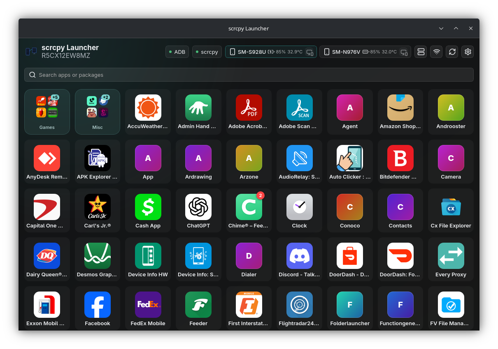

# scrcpy Launcher

[](https://github.com/richardred15/scrcpy-launcher/releases/latest)
[](https://github.com/richardred15/scrcpy-launcher/actions)
[](https://github.com/richardred15/scrcpy-launcher/blob/main/LICENSE)
[](https://v2.tauri.app)
[](https://www.rust-lang.org)
[](https://www.typescriptlang.org)

Launch Android apps as separate desktop windows via scrcpy virtual displays. Built with Tauri 2 + Rust + vanilla TypeScript.

[](docs/screenshots/latest.png)

## Features

- **One-click launch** — browse and launch all launcher-enabled apps from a connected Android device
- **Smart focus** — clicking a running app focuses its existing window instead of launching a duplicate
- **Desktop folders** — organize apps into named folders with an Android-style modal picker; favorites are a built-in folder
- **Notification badges** — unread counts shown as red badges on app cards, polled from the device every 30s
- **Wireless ADB** — connect to devices over the network with separate IP/port inputs; remembers saved devices
- **Adaptive icons** — extracts and composites foreground/background layers from APKs for Samsung and other adaptive-icon apps
- **Web metadata** — resolves app names and icons from Google Play / F-Droid with ADB fallback; caches results to disk
- **Search** — real-time filter with debounce; searches both app names and package names
- **Device info** — battery level, temperature, model, and Android version shown in the top bar
- **Context menu** — right-click any app to add/remove from favorites or move to a folder
- **Custom binary paths** — configure adb and scrcpy locations in the settings panel
- **Flexible virtual display** — optional `--flex-display` for scrcpy ≥4.0
- **Kill-on-close** — optionally terminate all scrcpy children when the launcher exits

## Requirements

### Runtime

| Dependency | Required | Purpose |
|---|---|---|
| [Android platform-tools (adb)](https://developer.android.com/tools/adb) | Yes | Device communication and app queries |
| [scrcpy](https://github.com/Genymobile/scrcpy) | Yes | Screen mirroring and virtual displays |
| [kdotool](https://github.com/jinliu/kdotool) | KDE Wayland only | Window focus via KWin scripting API |
| [xdotool](https://github.com/jordansissel/xdotool) | X11 fallback | Window focus on X11/XWayland |

### Build

- Node.js ≥18
- Rust toolchain (Cargo)
- Linux: `libwebkit2gtk-4.1-dev`, `libgtk-3-dev`, `libayatana-appindicator3-dev`

## Releases

Pre-built packages are attached to each release. Download the latest from the [releases page](https://github.com/richardred15/scrcpy-launcher/releases/latest).

| Format | File |
|--------|------|
| Debian / Ubuntu | `scrcpy-launcher_*.deb` |
| Fedora / RHEL | `scrcpy-launcher-*.rpm` |
| Windows | `scrcpy-launcher_*.msi` or `*.exe` (NSIS installer) |

## Installation

### From source

```sh
git clone https://github.com/richardred15/scrcpy-launcher
cd scrcpy-launcher
npm install
cargo install kdotool                    # KDE Wayland window focus
npm run tauri:dev                        # development mode with hot-reload
npm run tauri build                      # production binary
```

### Dependencies

```sh
# Arch / CachyOS
sudo pacman -S android-tools scrcpy xdotool
cargo install kdotool

# Debian / Ubuntu
sudo apt install android-sdk-platform-tools scrcpy xdotool
cargo install kdotool

# Fedora
sudo dnf install android-tools scrcpy xdotool
cargo install kdotool

# macOS
brew install android-platform-tools scrcpy

# Windows (not yet supported)
scoop install adb scrcpy
```

## Usage

1. Enable **USB debugging** on your Android device
2. Connect the device and authorize the connection
3. Launch scrcpy-launcher — it auto-detects the device and lists installed apps
4. **Click** any app card to open it in a new scrcpy window; click again to focus
5. **Right-click** an app to add it to Favorites or an existing folder, or create a new folder
6. **Search** by app name or package name with the search bar

For wireless connections, click the Wi-Fi button in the top bar, enter the device IP (port defaults to 5555), and press Enter or click Connect. The launcher remembers saved devices for quick reconnect.

The settings panel (gear icon) lets you:
- Point to custom adb/scrcpy binaries
- Toggle system package visibility, flexible display, and kill-on-close
- Choose icon source (generated placeholders or web metadata)
- Set virtual display bounds
- Manage saved wireless devices

## Architecture

The Rust backend manages device communication (ADB), scrcpy process lifecycle, and a background worker that resolves app metadata (names, icons) through a waterfall: on-disk cache → Google Play scrape → F-Droid scrape → APK icon extraction. Results stream to the frontend as per-app events so the grid appears instantly and updates in-place.

The frontend is a vanilla TypeScript SPA with a layered rendering pipeline: instant grid from package data, merge cached metadata on mount, then fire-and-forget batch resolution for uncached apps. Window focus uses kdotool on KDE Wayland with an xdotool fallback on X11, both running on background threads.

## Configuration

Settings are persisted to the OS config directory (`~/.config/dev.scrcpy-launcher/` on Linux). App metadata and icons are cached in `~/.cache/dev.scrcpy-launcher/`.

## Known limitations

- **Windows support** — not yet implemented (needs `SetForegroundWindow` for focus)
- **Samsung API 36+** — `dumpsys package` no longer emits `application-label:`, making web scraping the only source of correct app names on OneUI 7
- **Split APKs** — only the base APK is used for icon extraction
- **Samsung system icons** — some system apps only define adaptive icon XMLs with no bundled PNGs; the launcher composites them from extracted layers
- **scrcpy ≥4.0** required for `--flex-display`
